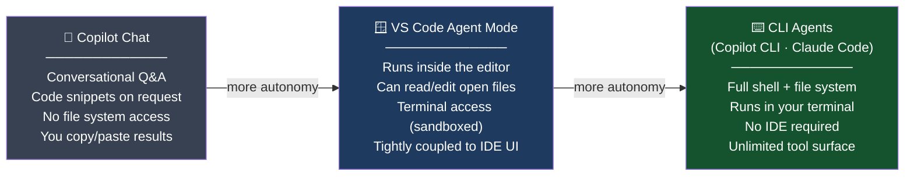
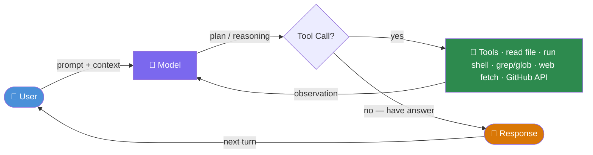
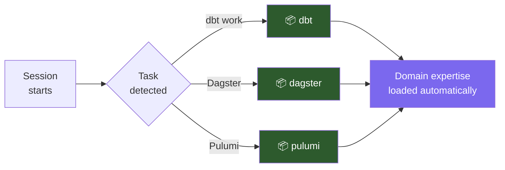
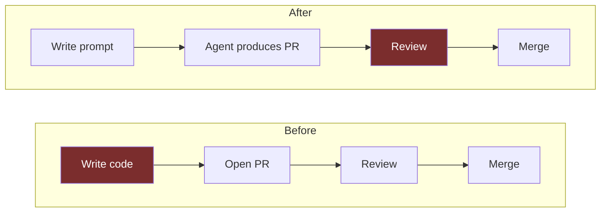
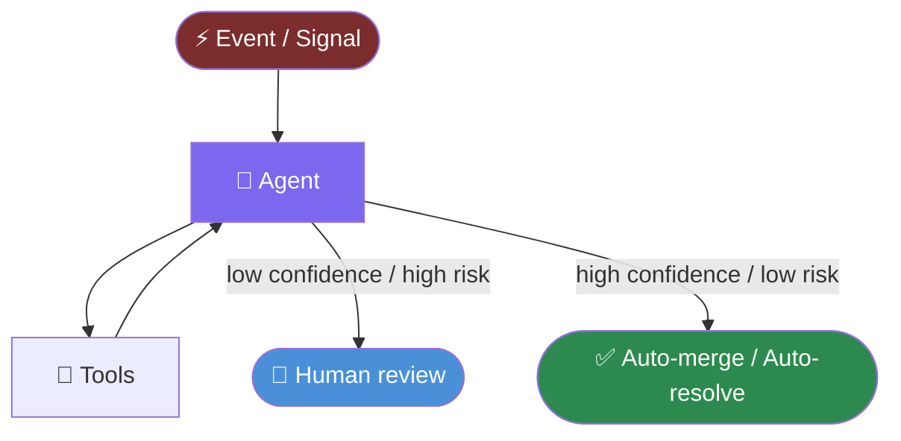

# Agentic Engineering

Patterns that make AI coding tools actually work

<div class="pt-12">
  <span class="px-2 py-1 rounded cursor-pointer" hover="bg-white bg-opacity-10">
    Press <kbd>Space</kbd> to advance
  </span>
</div>

---
layout: default
---

# Agenda

<v-clicks>

1. **What is an agentic coding tool?** — beyond autocomplete
2. **Tool landscape** — chat, IDE agent, CLI agent — where each fits
3. **The agentic loop** — how the model reasons and acts
4. **Context engineering** — giving the model what it needs, AGENTS.md, skills
5. **Real examples: good prompts** — patterns that work
6. **Anti-patterns** — what goes wrong and why
7. **Techniques** — plan mode, error context, iterative narrowing
8. **The shift in how we work** — objective-based, review strategy, validation loops, feedback signals, context curation, MCP hygiene
9. **The future: always-on agents** — autonomous workloads and the questions they raise
10. **Takeaways** — a checklist you can use today

</v-clicks>

---
layout: two-cols
---

# Autocomplete vs. Agent

::left::

### Traditional Copilot
- Inline suggestion at cursor
- Single completion, one context window
- You write; it fills in

```python
def get_user(id):
    # ↓ suggests: return db.query(User).get(id)
```

<br/>

**You are in control of every step.**

::right::

### Agentic Tool
- Given a goal, plans and executes
- Calls tools: reads files, runs shell, searches
- Iterates until done — or asks when stuck

```text
"Migrate the Dagster deployment to Helm.
 The current config is at src/.../__main__.py"
```

<br/>

**You describe the outcome. The agent figures out the steps.**

---

# The Spectrum of AI Coding Tools

Not all AI tools are the same — they sit at different points on an autonomy axis.

<div class="mt-6 overflow-x-auto">



</div>

<v-click>
<div class="mt-4 p-3 bg-gray-800 rounded text-sm">
  <strong>Key distinction:</strong> Chat tools are <em>reactive</em> — you ask, they answer.
  Agentic tools are <em>proactive</em> — you give a goal, they plan and execute.
</div>
</v-click>

---

# Tool Comparison

<div class="grid grid-cols-3 gap-2 text-xs mt-3 leading-tight">

<div class="p-2 rounded border border-gray-500 flex flex-col gap-1">
  <div class="font-bold text-sm">💬 Copilot Chat <span class="font-normal italic text-gray-400">· inline / sidebar</span></div>
  <div class="text-green-400 font-semibold mt-1">✅ Strengths</div>
  <ul class="list-disc list-inside space-y-0 text-gray-200 m-0 p-0">
    <li>Fast Q&amp;A on code</li>
    <li>Explain / document / review</li>
    <li>Low risk — no side effects</li>
  </ul>
  <div class="text-red-400 font-semibold mt-1">❌ Limitations</div>
  <ul class="list-disc list-inside space-y-0 text-gray-200 m-0 p-0">
    <li>No file system access</li>
    <li>You apply suggestions manually</li>
    <li>Context limited to open files</li>
    <li>No shell execution</li>
  </ul>
  <div class="mt-1"><span class="font-semibold">Best for:</span> Quick edits, code review prep, explaining unfamiliar code</div>
</div>

<div class="p-2 rounded border border-blue-600 bg-blue-950 flex flex-col gap-1">
  <div class="font-bold text-sm">🪟 VS Code Agent Mode <span class="font-normal italic text-gray-400">· in-editor</span></div>
  <div class="text-green-400 font-semibold mt-1">✅ Strengths</div>
  <ul class="list-disc list-inside space-y-0 text-gray-200 m-0 p-0">
    <li>Stays in your IDE workflow</li>
    <li>Can edit multiple files</li>
    <li>Integrated terminal access</li>
    <li>Sees your workspace tree</li>
  </ul>
  <div class="text-red-400 font-semibold mt-1">❌ Limitations</div>
  <ul class="list-disc list-inside space-y-0 text-gray-200 m-0 p-0">
    <li>Tightly coupled to VS Code</li>
    <li>Approval flow is per-file</li>
    <li>Harder to script or automate</li>
    <li>Context from open tabs only</li>
  </ul>
  <div class="mt-1"><span class="font-semibold">Best for:</span> Contained feature work, single-repo changes in VS Code</div>
</div>

<div class="p-2 rounded border border-green-600 bg-green-950 flex flex-col gap-1">
  <div class="font-bold text-sm">⌨️ Copilot CLI / Claude Code <span class="font-normal italic text-gray-400">· terminal</span></div>
  <div class="text-green-400 font-semibold mt-1">✅ Strengths</div>
  <ul class="list-disc list-inside space-y-0 text-gray-200 m-0 p-0">
    <li>Full shell &amp; filesystem</li>
    <li>Works across any editor</li>
    <li>Scriptable, composable</li>
    <li>Multi-repo, multi-dir tasks</li>
    <li>Plan mode + approval flow</li>
  </ul>
  <div class="text-red-400 font-semibold mt-1">❌ Limitations</div>
  <ul class="list-disc list-inside space-y-0 text-gray-200 m-0 p-0">
    <li>No visual IDE integration</li>
    <li>Requires terminal comfort</li>
    <li>Broader blast radius</li>
  </ul>
  <div class="mt-1"><span class="font-semibold">Best for:</span> Migrations, refactors, multi-file changes, infra tasks</div>
</div>

</div>

---
layout: default
---

# The Agentic Loop



<div class="text-sm text-gray-400 mt-4">
Each turn: model reads context → decides to call a tool or respond → result feeds back in → repeat
</div>

---

# What the Agent "Sees"

The model reasons over everything in its **context window** each turn:

<v-clicks>

- 📄 **Your prompt** — the instructions you write
- 🗂️ **File contents** — whatever it has read via tools
- 🖥️ **Shell output** — results of commands it ran
- 🧠 **Its own prior reasoning** — tool calls and observations
- 📋 **System instructions** — tool definitions, behavior guidelines
- 🌐 **External content** — web pages, GitHub API responses, docs

</v-clicks>

<v-click>

<div class="mt-6 p-4 bg-blue-950 rounded border border-blue-700">
  <strong>Implication:</strong> The agent can only act on what's in context.
  If the relevant file path, error, or constraint isn't in the prompt —
  the model will guess, hallucinate, or ask.
</div>

</v-click>

---

# Copilot CLI Modes

<div class="grid grid-cols-3 gap-4 mt-4">

<div class="p-4 rounded border border-gray-600">

### 💬 Interactive
Turn-by-turn conversation. You guide each step. Good for exploration and debugging.

</div>

<div class="p-4 rounded border border-yellow-600 bg-yellow-950">

### 🤖 Autopilot
Agent executes autonomously, auto-approving changes. Best for well-scoped, trusted tasks.

</div>

<div class="p-4 rounded border border-green-600 bg-green-950">

### 📋 Plan Mode `[[PLAN]]`
Agent plans first, presents for review, then executes. Best for complex or risky changes.

</div>

</div>

<v-click>

<div class="mt-6 p-4 bg-gray-800 rounded">

**Rule of thumb:** Use plan mode when the blast radius is large or the approach isn't obvious. Use autopilot when the task is scoped and you trust the direction.

</div>

</v-click>

---
layout: section
---

# Context Engineering

*Giving the model the right information to make the right decision*

---

# The Anatomy of a Good Prompt

<div class="grid grid-cols-2 gap-6 mt-4">

<div>

Every effective agentic prompt answers these questions:

<v-clicks>

- **What exists now?** Current state, relevant files, tech stack
- **What should change?** The desired outcome
- **Where is it?** Specific file paths, directories, modules
- **What are the constraints?** Backward compat, style, scope
- **How do I know it worked?** Success criteria or test command

</v-clicks>

</div>

<div v-click class="p-4 bg-gray-800 rounded text-sm">

```text
[Current state]
I currently have X that does Y.
The relevant code is at path/to/file.py.

[Desired outcome]
I would like to change it to do Z.

[Constraints]
Existing usages throughout the repo
should continue to work.

[Success criteria]
Running `pytest` should pass.
```

</div>

</div>

---

# File Paths Are Not Optional

The agent reads your codebase by calling tools. It doesn't "know" your project layout.

<div class="grid grid-cols-2 gap-6 mt-4">

<div class="p-4 bg-red-950 rounded border border-red-700">

### ❌ Vague

```text
Update the vault authentication module
to support OIDC.
```

Agent must guess which file. May read the wrong one, ask a clarifying question, or hallucinate a path.

</div>

<div class="p-4 bg-green-950 rounded border border-green-700">

### ✅ Specific

```text
Update the
packages/ol-orchestrate-lib/src/
ol_orchestrate/resources/secrets/vault.py
module to support OIDC as an
authentication method, taking a role
as an optional parameter.
```

Agent goes directly to the right file. No guessing.

</div>

</div>

---

# State What Exists, Then What Should Change

Give the agent a narrative: here's where we are, here's where we're going.

<div class="mt-4 p-4 bg-gray-800 rounded text-sm leading-relaxed">

> "The `dg_projects` directory contains self-contained Dagster code locations that work with the `dg` CLI.
> These were previously all located in a single shared location under `src/ol_orchestrate`.
> The shared logic is now located in `packages/ol-orchestrate-lib`.
> Review the contents of `ol-orchestrate-lib` and the imports in the `dg_projects` code locations.
> For any code which exists in `ol-orchestrate-lib` that is only used by a single code location,
> move that code into the code location directly."

</div>

<v-clicks>

<div class="mt-4 grid grid-cols-3 gap-3 text-sm">

<div class="p-3 bg-blue-950 rounded">
  📍 <strong>History</strong><br/>Where it came from
</div>

<div class="p-3 bg-purple-950 rounded">
  🗂️ <strong>Locations</strong><br/>Specific directories
</div>

<div class="p-3 bg-green-950 rounded">
  🎯 <strong>Action</strong><br/>Precise instruction
</div>

</div>

</v-clicks>

---

# Include Constraints

Agents are optimistic — they'll make sweeping changes if you don't set limits.

<div class="grid grid-cols-2 gap-6 mt-4">

<div class="p-4 bg-red-950 rounded border border-red-700 text-sm">

### ❌ No constraints

```text
Update OLEKSAuthBinding to support
multiple service accounts.
```

Agent may break existing call sites, change public API shape, or refactor things you didn't ask for.

</div>

<div class="p-4 bg-green-950 rounded border border-green-700 text-sm">

### ✅ With constraints

```text
Update it to allow passing multiple
service accounts through, while making
sure that existing uses of it and
dependent components are still
functional in their other usages
throughout the repository.
```

</div>

</div>

<v-click>
<div class="mt-4 p-3 bg-gray-800 rounded text-sm">
  Common constraints worth stating: backward compatibility, performance bounds, file scope, style conventions, what <em>not</em> to touch.
</div>
</v-click>

---

# Reference External Docs

Agents can fetch URLs. Use this for fast-moving libraries, proprietary APIs, or anything post-training.

<div class="grid grid-cols-2 gap-6 mt-6">

<div class="p-4 bg-green-950 rounded border border-green-700 text-sm">

```text
I would like to migrate this to use
the Dagster Helm chart for deployment
on Kubernetes. The documentation page
that covers this is at
https://docs.dagster.io/deployment/
guides/kubernetes/deploying-with-helm
```

</div>

<div class="mt-2 text-sm space-y-3">

<v-clicks>

- **`llms.txt`** — Many projects publish a flat doc index optimized for LLM context
- **API reference URLs** — For SDKs the model may not know well
- **GitHub issues / PRs** — Link the ticket that describes the desired behavior
- **Internal runbooks** — Paste or link relevant ops docs

</v-clicks>

</div>

</div>

---

# Include Success Criteria

Tell the agent how you'll know it worked. This guides its verification behavior.

<div class="grid grid-cols-2 gap-6 mt-6">

<div class="p-4 bg-green-950 rounded border border-green-700 text-sm">

**Explicit test command:**
```text
Evaluate the dependencies in the
pyproject.toml files for each project
in dg_projects to ensure that they are
properly reflected and will result in
a working docker image.
```

</div>

<div class="p-4 bg-blue-950 rounded border border-blue-700 text-sm">

**Accept / reject guidance:**
```text
Run `uv run mypy dg_projects` to
evaluate errors and propose fixes.
Valid fixes can also include ignoring
errors if they do not prevent the
functionality of the logic.
```

</div>

</div>

<v-click>
<div class="mt-4 p-3 bg-gray-800 rounded text-sm">
  Success criteria also help the agent decide <em>when to stop</em> — without them, it may over-engineer or quit too early.
</div>
</v-click>

---

# The Context Budget

Context windows are large but not infinite. Quality > quantity.

<div class="grid grid-cols-2 gap-6 mt-4">

<div>

<v-clicks>

**Include:**
- The specific files you want changed
- The error or behavior you're seeing
- Related config files or schemas
- Constraints and success criteria

**Exclude:**
- Unrelated parts of the codebase
- Entire test suites "just in case"
- Repeated context already established
- Boilerplate the agent can find itself

</v-clicks>

</div>

<div v-click class="p-4 bg-gray-800 rounded text-sm">

**The focused prompt wins:**

```text
# Instead of:
"Here is my entire repo. Fix the auth bug."

# Use:
"The Vault authentication in
packages/.../vault.py is failing with
OIDC in production. The relevant code
is in the `authenticate()` method.
Update it to support the OIDC flow
using the hvac library's OIDC API."
```

</div>

</div>

---

# AGENTS.md — Base Context That's Always There

Instead of re-explaining your project every session, codify it once.

<div class="grid grid-cols-2 gap-6 mt-4 text-sm">

<div>

**What `AGENTS.md` is:**

An `AGENTS.md` file at the root of your repository is automatically loaded by supported agents at the start of every session. It's your standing brief — the context the agent always needs, so you never have to repeat it.

<v-clicks>

**What to put in it:**
- Project layout and key directories
- How to run tests, lint, and build
- Coding conventions and style rules
- What tools are available (`uv`, `dg`, `helm`, etc.)
- Things the agent should *never* do (force-push, drop tables, etc.)
- Links to internal docs or architecture references

</v-clicks>

</div>

<div v-click class="p-3 bg-gray-800 rounded text-xs font-mono leading-relaxed">

```markdown
# AGENTS.md

## Project layout
- `dg_projects/` — Dagster code locations (one per subdirectory)
- `packages/ol-orchestrate-lib/` — shared resources and ops
- `src/ol_dbt/` — dbt project

## Running things
- Tests: `uv run pytest`
- Type check: `uv run mypy dg_projects packages`
- Build image: `docker build -f <dir>/Dockerfile .`

## Conventions
- All Dagster resources use HVAC for Vault auth
- Kubernetes auth in non-dev environments
- Never modify `pyproject.toml` lock files manually

## Do not
- Push directly to main
- Modify shared resources without checking all consumers
```

</div>

</div>

---

# Agent Skills — Incidental Context on Demand

Skills extend the agent with specialized, task-specific knowledge — loaded only when relevant.

<div class="mt-4 text-sm">

<div class="font-semibold mb-2">What skills are:</div>

<v-clicks>

<ul class="list-disc list-inside space-y-2 m-0 p-0 mb-4">
  <li>Installable packages that add domain knowledge and tool guidance</li>
  <li>Activated when the agent detects a matching task</li>
  <li>Discoverable at <strong><a href="https://skills.sh">skills.sh</a></strong> — a public registry of community and vendor skills</li>
</ul>

<div>
<div class="font-semibold mb-2">Examples of available skills:</div>
<ul class="list-disc list-inside space-y-2 m-0 p-0 mb-4">
  <li><code>dagster</code> — project structure, <code>dg</code> CLI patterns, asset definitions</li>
  <li><code>dbt</code> — model building, semantic layer, unit tests</li>
  <li><code>pulumi</code> — component authoring, output handling, best practices</li>
  <li><code>flutter</code>, <code>superset</code>, <code>dagster-integrations</code> — tool-specific expertise</li>
</ul>
</div>

<div class="p-3 bg-gray-800 rounded text-gray-300">Skills inject the right domain knowledge without you explaining it — and aren't loaded when irrelevant, so they don't pollute unrelated sessions.</div>

</v-clicks>

</div>

---

# Agent Skills — How It Works

<div class="grid grid-cols-2 gap-6 mt-6 items-center">

<div>



</div>

<div class="p-4 bg-gray-800 rounded text-sm space-y-4">
  <div>
    <div class="font-semibold text-green-400 mb-1">📄 AGENTS.md</div>
    <div>Base context — always loaded. Project layout, conventions, tooling, do-nots.</div>
  </div>
  <div>
    <div class="font-semibold text-blue-400 mb-1">📦 Skills</div>
    <div>Incidental context — loaded on demand. Domain expertise for the current task only.</div>
  </div>
  <div class="pt-2 border-t border-gray-600 text-gray-300">
    Together they eliminate most of the orientation boilerplate you'd otherwise write at the start of every session.
  </div>
</div>

</div>

---
layout: section
---

# Real Examples
## Good Prompts from the Field

---

# Example: Context-Rich Migration

<div class="p-4 bg-gray-800 rounded text-sm leading-relaxed mt-2">

> "I currently have a deployment of Dagster that uses docker-compose on an EC2 server. This is deployed using Pulumi. The deployment logic is located at `src/ol_infrastructure/applications/dagster/__main__.py` and the AMI build logic is located at `src/bilder/images/dagster`. I would like to migrate this to use the Dagster Helm chart for deployment on Kubernetes. The documentation page that covers this is at `https://docs.dagster.io/deployment/guides/kubernetes/deploying-with-helm`."

</div>

<div class="grid grid-cols-4 gap-3 mt-6 text-sm">

<div class="p-3 bg-blue-950 rounded">
  🏗️ <strong>Current state</strong><br/>docker-compose on EC2 via Pulumi
</div>

<div class="p-3 bg-purple-950 rounded">
  🗂️ <strong>File locations</strong><br/>Both the deployment and image build paths
</div>

<div class="p-3 bg-green-950 rounded">
  🎯 <strong>Goal</strong><br/>Helm chart on Kubernetes
</div>

<div class="p-3 bg-yellow-950 rounded">
  📚 <strong>Docs</strong><br/>Direct URL to the relevant guide
</div>

</div>

---

# Example: Scoped Module Update

<div class="p-4 bg-gray-800 rounded text-sm leading-relaxed mt-2">

> "Update the `packages/ol-orchestrate-lib/src/ol_orchestrate/resources/secrets/vault.py` module to support OIDC as an authentication method, taking a role as an optional parameter."

</div>

<v-click>

<div class="mt-6 p-4 bg-green-950 rounded border border-green-700 text-sm">

**Why it works:**
- Exact file path — no searching required
- Single, clear behavior change
- Interface detail specified (`role` as optional param)
- Implies "don't break existing auth methods" by saying "support OIDC *as well*"

</div>

</v-click>

<v-click>

<div class="mt-4 p-4 bg-gray-700 rounded text-sm">

**Pattern:** `Update <exact path> to <specific behavior>, taking <parameter> as <type>.`

Simple tasks don't need long prompts — they need *precise* ones.

</div>

</v-click>

---

# Example: Refactor with History

<div class="p-4 bg-gray-800 rounded text-sm leading-relaxed mt-2">

> "This repository consists of a Dagster project located under `src/ol_orchestrate` and a dbt project located at `src/ol_dbt`. I would like to refactor the Dagster project to follow the new `dg` style workspace and project layout. There are many shared libraries and resources in the Dagster project that are used across different 'projects' or 'code locations'. I would like to restructure the project to make logically separate `dg` projects that correspond to: lakehouse, open edX, edxorg, legacy openedx, canvas. The shared code should be extracted into a library package."

</div>

<div class="grid grid-cols-3 gap-3 mt-4 text-sm">

<div class="p-3 bg-blue-950 rounded">
  📖 <strong>History</strong><br/>What the repo structure was before
</div>

<div class="p-3 bg-purple-950 rounded">
  🗂️ <strong>Topology</strong><br/>Named code locations = named projects
</div>

<div class="p-3 bg-green-950 rounded">
  📦 <strong>Outcome</strong><br/>Library extraction strategy
</div>

</div>

---

# What Made These Work?

<div class="grid grid-cols-2 gap-6 mt-4">

<div>

**Structural patterns:**

<v-clicks>

- Open with the current state in one sentence
- Name every relevant file path explicitly
- State the goal in terms of behavior, not implementation
- Include constraints inline, not as afterthoughts
- Give the agent a URL when docs exist
- Define "done" — test command or acceptance criteria

</v-clicks>

</div>

<div v-click class="p-4 bg-gray-800 rounded text-sm">

**The mental model:**

> Imagine you're writing a ticket for a new engineer joining the team today — no context, no prior history, no Slack thread to read.
>
> That's what you're writing for the agent.

Every session starts fresh. The agent has no memory of yesterday's conversation.

</div>

</div>

---
layout: section
---

# Anti-Patterns
## What goes wrong and why

---

# Anti-Pattern: The Raw Error Dump

<div class="grid grid-cols-2 gap-6 mt-4">

<div class="p-4 bg-red-950 rounded border border-red-700 text-sm">

### ❌ What gets sent

```text
dagster._core.errors.DagsterInvalidDefinitionError:
resource with key 'openedx' required by op
'openedx__courseware' was not provided.
Please provide a ResourceDefinition to key
'openedx', or change the required key to one
of the following keys which points to an
ResourceDefinition: ['io_manager',
's3file_io_manager', 'vault', 's3',
'duckdb', 'openedx_mitx', ...]

  File "/app/.venv/.../definitions.py", line 847
  ... [14,000 more characters of stack trace]
```

</div>

<div class="text-sm space-y-4 mt-2">

<v-clicks>

**What the agent is missing:**
- What you were trying to do
- What you already tried
- Which approach you want taken
- Whether this is a config issue, code issue, or both

**What happens instead:**
- Agent picks the most obvious fix (may be wrong)
- Spends turns investigating context it needed upfront
- May ask clarifying questions — which you could have answered in the prompt

</v-clicks>

</div>

</div>

---

# Anti-Pattern: The Raw Error Dump — Fixed

<div class="p-4 bg-green-950 rounded border border-green-700 text-sm leading-relaxed mt-4">

> "The openedx code location is failing to load with a `DagsterInvalidDefinitionError` — the `openedx` resource key is missing. The definitions are in `dg_projects/openedx/definitions.py`. The resource was previously injected at the job level but we've since moved to repository-level resource binding. Update the definitions to bind the `openedx` resource at the repository level using the existing resource definitions in `packages/ol-orchestrate-lib/src/ol_orchestrate/resources/`."

</div>

<div class="grid grid-cols-3 gap-3 mt-6 text-sm">

<div class="p-3 bg-blue-950 rounded">
  🔍 <strong>Error summary</strong><br/>One line, not 14k chars
</div>

<div class="p-3 bg-purple-950 rounded">
  🗂️ <strong>Context</strong><br/>What changed that caused this
</div>

<div class="p-3 bg-green-950 rounded">
  🎯 <strong>Direction</strong><br/>Which approach to take
</div>

</div>

---

# Anti-Pattern: Context-Free Follow-Ups

Each new message is a **continuation of the same context window** — but only if that context is still there.

<div class="grid grid-cols-2 gap-6 mt-4">

<div class="p-4 bg-red-950 rounded border border-red-700 text-sm">

### ❌ Loses context

```text
> Continue fixing the mypy errors
```

```text
> Migrate the next code location
```

```text
> Migrate the legacy_openedx code
  location next
```

```text
> Perform the migration now
```

The agent has to guess which errors, which location, what migration pattern to use.

</div>

<div class="p-4 bg-green-950 rounded border border-green-700 text-sm">

### ✅ Re-anchors context

```text
> There are type errors in dg_projects.
  Run `uv run mypy dg_projects packages`
  to get the full list and fix them.
```

```text
> Migrate the canvas code location next
  using the same pattern you used for
  legacy_openedx: separate pyproject.toml,
  Dockerfile, and build.yaml.
```

</div>

</div>

---

# Anti-Pattern: Assumed Context

New sessions start with a blank slate.

<div class="grid grid-cols-2 gap-6 mt-6">

<div class="p-4 bg-red-950 rounded border border-red-700 text-sm">

### ❌ What was sent

```text
Defaulting to `k8s-data`
```

This was the entire prompt — a fragment from a previous conversation that no longer existed in context.

**The agent had no idea what this referred to.**

</div>

<div class="p-4 bg-yellow-950 rounded border border-yellow-600 text-sm">

### 💡 What to do instead

Before starting a new session on an in-progress task, provide a quick orientation:

```text
We're continuing the Dagster Helm
migration from yesterday. The current
state: all code locations have been
migrated except canvas. The deployment
config is at src/ol_infrastructure/
applications/dagster/__main__.py.
Next: migrate the canvas code location.
```

</div>

</div>

---

# Anti-Pattern: Rubber-Stamp Approval

Plan mode asks for review. Approving without reading removes the benefit entirely.

<div class="grid grid-cols-2 gap-6 mt-4">

<div class="p-4 bg-red-950 rounded border border-red-700 text-sm">

### ❌ Dangerous

```text
> Yes, proceed with all changes.
```

```text
> Looks good, go ahead.
```

If the plan has a scope error, wrong approach, or missed constraint — you've approved it without catching it.

</div>

<div class="p-4 bg-green-950 rounded border border-green-700 text-sm">

### ✅ Engage with the plan

Things to check before approving:

- Does the file list match what you expected?
- Is the approach what you had in mind?
- Are any unrelated files in the change set?
- Does the plan account for backward compat?
- Does it match your constraint from the prompt?

</div>

</div>

<v-click>
<div class="mt-4 p-3 bg-gray-800 rounded text-sm">
  Plan mode exists to catch mistakes <em>before</em> they're made. Use it.
</div>
</v-click>

---

# Anti-Pattern: Ambiguous Scope

Vague scope forces the agent to make assumptions — and it will.

<div class="p-4 bg-red-950 rounded border border-red-700 text-sm mt-4 leading-relaxed">

### ❌

> "I have migrated the deployment of these Dagster definitions to run on Kubernetes. Update all of the handling of Vault authentication for non-dev environments to use Kubernetes auth."

</div>

<v-click>

**What's missing:**

<div class="grid grid-cols-2 gap-4 mt-3 text-sm">

<div class="p-3 bg-gray-700 rounded">

- Which directories / modules contain the auth handling?
- How many call sites are there?
- What does "Kubernetes auth" mean here — OIDC? Service account tokens? HVAC?

</div>

<div class="p-3 bg-gray-700 rounded">

- Should non-Kubernetes environments (local dev) be unchanged?
- What existing auth methods should be preserved?
- Is this a config change, code change, or both?

</div>

</div>

</v-click>

---

# Anti-Pattern Gallery

| Pattern | Example | Why it fails |
|---|---|---|
| Raw error dump | 14k stack trace, no preamble | Agent picks wrong fix, wastes turns |
| Context-free follow-up | "Continue fixing the mypy errors" | Agent guesses which errors, which file |
| Assumed context | `"Defaulting to k8s-data"` | Agent has no idea what this refers to |
| Rubber-stamp | "Yes, proceed with all changes" | Bypasses plan review entirely |
| Ambiguous scope | "Update all Vault auth to use k8s" | Agent makes sweeping, wrong assumptions |
| Typo/accident | `"ghc"` | Wastes a full agent turn |
| No constraints | "Migrate this to the new API" | Breaks existing consumers |

---
layout: section
---

# Patterns & Techniques

---

# Plan Mode

Use `[[PLAN]]` at the start of your prompt for complex or risky tasks.

```text
[[PLAN]] I want to migrate the Dagster deployment from docker-compose to Helm.
The current infra is at src/ol_infrastructure/applications/dagster/__main__.py.
The target is a Kubernetes cluster. Documentation at https://docs.dagster.io/...
```

<div class="grid grid-cols-3 gap-3 mt-4 text-sm">

<v-clicks>

<div class="p-3 bg-blue-950 rounded">
  📋 <strong>Agent plans first</strong><br/>Lists files to change, approach, decisions
</div>

<div class="p-3 bg-purple-950 rounded">
  👀 <strong>You review</strong><br/>Catch scope errors before code is written
</div>

<div class="p-3 bg-green-950 rounded">
  ✅ <strong>Then executes</strong><br/>With your approval, carries out the plan
</div>

</v-clicks>

</div>

<v-click>

<div class="mt-3 p-3 bg-gray-800 rounded text-sm">
  <strong>When to use:</strong> Large refactors, migrations, changes touching many files, anything where the wrong approach would be expensive to undo.
</div>

</v-click>

---

# Iterative Narrowing

Start broad to orient the agent, then narrow to targeted actions — re-anchoring each turn.

<div class="mt-4 text-sm">

<div class="font-semibold mb-2">Turn 1 — Broad exploration:</div>
```text
Review the contents of ol-orchestrate-lib and the imports in the dg_projects
code locations. For any code that exists in ol-orchestrate-lib and is only used
by a single code location, identify it and tell me what you find before making
any changes.
```

<div class="font-semibold mb-2 mt-4">Turn 2 — Targeted action:</div>
```text
Move the identified single-use modules into their respective code locations.
Start with the openedx code location.
```

<v-click>
<div class="mt-4 p-3 bg-blue-950 border border-blue-700 rounded text-gray-300">
  The agent explored first and reported back. Turn 2 is precise because Turn 1 already established shared understanding — no guessing required.
</div>
</v-click>

</div>

---

# Iterative Narrowing — The Pattern

<div class="grid grid-cols-2 gap-6 mt-6 text-sm">

<div class="p-4 bg-gray-800 rounded">
  <div class="font-semibold mb-3">The four-step loop:</div>
  <ol class="list-decimal list-inside space-y-3 m-0 p-0">
    <li><strong>Explore</strong> — confirm the agent's understanding before acting</li>
    <li><strong>Scope</strong> — agree on exactly what will change</li>
    <li><strong>Execute</strong> — one logical unit at a time</li>
    <li><strong>Verify</strong> — check the result, then continue</li>
  </ol>
</div>

<div class="p-4 bg-gray-700 rounded">
  <div class="font-semibold mb-3">Why it matters:</div>
  <div class="space-y-3 text-gray-300">
    <div>Agents can <strong>drift</strong> on large tasks — small misunderstandings early compound into large corrections later.</div>
    <div>Checkpoints give you an off-ramp <strong>before</strong> the agent has done significant work in the wrong direction.</div>
    <div>Each verified unit also <strong>anchors</strong> the next turn with confirmed context.</div>
  </div>
</div>

</div>

---

# The Error Context Pattern

When something breaks, give the agent three things: error, context, direction.

<div class="mt-3 p-3 bg-gray-800 rounded text-sm leading-relaxed">

> **Error (summary):** The canvas code location is failing to start with a Vault authentication error — it's attempting GitHub auth instead of Kubernetes auth.
>
> **Context:** We recently migrated this deployment to Kubernetes. The other code locations in `dg_projects/` were updated to use the HVAC Kubernetes auth method in an earlier session. Canvas was missed.
>
> **Direction:** Update `dg_projects/canvas/resources/vault.py` to use Kubernetes auth using the same pattern as `dg_projects/openedx/resources/vault.py`.

</div>

<div class="grid grid-cols-3 gap-3 mt-3 text-sm">

<div class="p-3 bg-red-950 rounded">
  ⚠️ <strong>Error (summary)</strong><br/>One sentence — not a full trace
</div>

<div class="p-3 bg-blue-950 rounded">
  📖 <strong>Context</strong><br/>What changed, why it matters
</div>

<div class="p-3 bg-green-950 rounded">
  🧭 <strong>Direction</strong><br/>Explicit "use this pattern"
</div>

</div>

---

# Tool Awareness

Agents have tools. Reference them in your prompt to guide behavior.

<div class="grid grid-cols-2 gap-6 mt-4 text-sm">

<div>

**Shell / CLI tools:**
```text
Run `uv run mypy dg_projects packages`
to get the full list of errors.
```

**File search:**
```text
Review all pyproject.toml files
in the dg_projects directory.
```

**Web fetch:**
```text
The documentation is at
https://docs.dagster.io/llms.txt
```

</div>

<div>

**GitHub integration:**
```text
Open a technical issue in this
repository to track processing
course XML from open edX courses.
```

**Verification:**
```text
After making changes, run
`docker build .` to verify the
image builds correctly.
```

</div>

</div>

<v-click>
<div class="mt-4 p-3 bg-gray-800 rounded text-sm">
  You don't need to specify every tool — the agent chooses them. But naming a command or URL signals <em>how</em> to verify and where to look.
</div>
</v-click>

---

# Model-Agnostic Principles

These patterns work across Claude, GPT, Gemini, and whatever comes next.

<div class="grid grid-cols-2 gap-4 mt-6 text-sm">

<v-clicks>

<div class="p-4 bg-gray-700 rounded">
  🗂️ <strong>Specificity beats cleverness</strong><br/>Exact file paths > clever descriptions
</div>

<div class="p-4 bg-gray-700 rounded">
  📖 <strong>History enables continuity</strong><br/>Summarize prior sessions at the start of new ones
</div>

<div class="p-4 bg-gray-700 rounded">
  🎯 <strong>Constraints prevent drift</strong><br/>Say what not to touch, not just what to change
</div>

<div class="p-4 bg-gray-700 rounded">
  ✅ <strong>Define done</strong><br/>Test command > vague "make it work"
</div>

<div class="p-4 bg-gray-700 rounded">
  🔍 <strong>Review before you approve</strong><br/>Plan mode is only useful if you read the plan
</div>

<div class="p-4 bg-gray-700 rounded">
  📦 <strong>One concern per prompt</strong><br/>Mixed goals produce mixed results
</div>

</v-clicks>

</div>

---
layout: section
---

# The Shift in How We Work

*From writing code to directing agents*

---

# From Task-Based to Objective-Based Work

Agentic tools don't just make you faster at the same tasks — they change which tasks are yours.

<div class="grid grid-cols-2 gap-4 mt-4 text-sm">

<div class="p-3 bg-gray-700 rounded">
  <div class="font-bold mb-2">Before: Task-Based</div>
  <div class="text-gray-300 mb-2">You own the implementation details.</div>
  <ul class="list-disc list-inside space-y-1 m-0 p-0">
    <li>Write the migration function</li>
    <li>Wire up the test fixture</li>
    <li>Update the import paths</li>
    <li>Fix the type error on line 47</li>
  </ul>
  <div class="mt-2 italic text-gray-300"><strong>Mental model:</strong> "What do I need to type next?"</div>
</div>

<div class="p-3 bg-green-950 rounded border border-green-700">
  <div class="font-bold mb-2">After: Objective-Based</div>
  <div class="text-gray-300 mb-2">You own the outcome and the judgment calls.</div>
  <ul class="list-disc list-inside space-y-1 m-0 p-0">
    <li>Define the migration strategy</li>
    <li>Set the acceptance criteria</li>
    <li>Identify the constraints</li>
    <li>Review the diff and approve</li>
  </ul>
  <div class="mt-2 italic text-gray-300"><strong>Mental model:</strong> "Is this the right outcome?"</div>
</div>

</div>

<v-click>
<div class="mt-3 p-3 bg-blue-950 rounded border border-blue-700 text-sm">
  The skill that grows in value: <strong>knowing what good looks like</strong> — not knowing how to type it.
</div>
</v-click>

---

# The New Role: Agent Director

The engineer's job shifts up the abstraction stack.

<div class="grid grid-cols-3 gap-2 mt-3 text-xs leading-snug">

<v-clicks>

<div class="p-3 bg-gray-700 rounded">
  <div class="font-semibold mb-1">🗺️ Decompose problems</div>
  Break large goals into well-scoped, sequenced agent tasks — small enough to verify, large enough to be worthwhile
</div>

<div class="p-3 bg-gray-700 rounded">
  <div class="font-semibold mb-1">📋 Write the brief, not the code</div>
  A well-written prompt with clear context and constraints is the deliverable — the agent writes the code
</div>

<div class="p-3 bg-gray-700 rounded">
  <div class="font-semibold mb-1">🔍 Review with intent</div>
  The review is where your engineering judgment lands. You're verifying correctness, not authoring it
</div>

<div class="p-3 bg-gray-700 rounded">
  <div class="font-semibold mb-1">🧭 Set the architecture</div>
  Agents implement within the boundaries you set. Patterns, abstractions, and system design remain human decisions
</div>

<div class="p-3 bg-gray-700 rounded">
  <div class="font-semibold mb-1">⚠️ Manage risk</div>
  Decide what needs a plan, what gets reviewed, what can ship directly — and own the consequences
</div>

<div class="p-3 bg-gray-700 rounded">
  <div class="font-semibold mb-1">🔁 Iterate fast</div>
  Multiple agent sessions per hour is normal. The bottleneck moves from writing to reviewing
</div>

</v-clicks>

</div>

<div class="grid grid-cols-2 gap-4 mt-4 text-xs">

<div class="p-3 bg-yellow-950 rounded border border-yellow-600">
  <div class="font-semibold mb-1">🤔 Open question: commit the plan?</div>
  <div class="text-gray-300">Agents generate <code>plan.md</code> files during complex sessions. Should these be committed as a historical artifact — documenting <em>why</em> a change was made alongside the code that made it? Or are they noise in the git log?<br/><br/>Committing plans gives future engineers (and agents) architectural context. Excluding them keeps history clean. Your team should decide deliberately.</div>
</div>

<div class="p-3 bg-blue-950 rounded border border-blue-600">
  <div class="font-semibold mb-1">🌿 Scaling up: git worktrees</div>
  <div class="text-gray-300">Running multiple agent sessions in parallel requires isolated working directories. <code>git worktree</code> lets you check out separate branches into separate directories from a single repo — each agent gets its own tree with no interference.<br/><br/><code>git worktree add ../feature-x feature/x</code><br/><br/>One agent refactors auth while another fixes the CI pipeline — no stash conflicts, no branch switching.</div>
</div>

</div>

---

# The Bottleneck Shifts to Review

When agents can produce a PR in minutes, the queue that backs up is not implementation — it's review.



---

# The Bottleneck Shifts to Review

<div class="grid grid-cols-2 gap-6 mt-6 text-sm">

<div class="p-4 bg-gray-700 rounded">

**What this means for teams:**
- PR volume increases dramatically
- Human review time is the scarce resource
- Waiting for review becomes the velocity limiter
- Batch review strategies start to matter

</div>

<div class="p-4 bg-blue-950 rounded border border-blue-700">

**Two responses:**
1. **Automate first-pass review** — let tools do the initial triage before a human looks
2. **Change review strategy** — not every PR needs the same level of scrutiny

</div>

</div>

---

# Automated First-Pass Review

Use AI tooling to clear the noise before a human reads a single line.

<div class="grid grid-cols-3 gap-4 mt-6 text-sm">

<v-clicks>

<div class="p-4 rounded border border-gray-500">

### 🤖 GitHub Copilot Reviewer
Inline PR review in GitHub. Flags code quality issues, suggests improvements, explains diffs. Runs as part of the PR workflow — a review is posted automatically when a PR opens.

**Best for:** Style, logic errors, missing test coverage, documentation gaps

</div>

<div class="p-4 rounded border border-blue-600 bg-blue-950">

### 🔷 Gemini Code Review
Google's Gemini model integrated into the PR review flow. Focuses on correctness, security antipatterns, and architectural coherence. Can be configured per-repo with custom guidelines.

**Best for:** Security review, complex logic validation, cross-cutting concerns

</div>

<div class="p-4 rounded border border-purple-600 bg-purple-950">

### 🛡️ Sentry Seer
AI-assisted issue triage and root cause analysis. Surfaces production errors likely introduced by a given PR, correlates stack traces to the diff, and suggests fixes.

**Best for:** Connecting PRs to production impact, catching regressions before they escalate

</div>

</v-clicks>

</div>

<v-click>
<div class="mt-4 p-3 bg-gray-800 rounded text-sm">
  The goal: by the time a human reviewer opens the PR, the trivial issues are already resolved and the automated tools have flagged anything risky.
</div>
</v-click>

---

# Ship, Show, Ask

Not every change needs the same review. Categorize by risk.

<div class="grid grid-cols-3 gap-3 mt-3 text-xs leading-snug">

<div class="p-3 rounded border border-green-600 bg-green-950">
<div class="font-bold text-sm mb-1">🚀 Ship</div>
<div class="mb-1"><strong>Merge directly to main.</strong> No pre-merge review required. CI is green, author is a trusted project owner.</div>
<div class="font-semibold mb-1">Examples:</div>
<ul class="list-disc list-inside m-0 p-0 space-y-0">
  <li>Documentation updates</li>
  <li>Adding tests to existing features</li>
  <li>Minor bug fixes with green CI</li>
  <li>Dependency version bumps (automated)</li>
</ul>
</div>

<div class="p-3 rounded border border-yellow-600 bg-yellow-950">
<div class="font-bold text-sm mb-1">👀 Show</div>
<div class="mb-1"><strong>Merge, then review.</strong> High velocity, maintained visibility. Review happens post-merge for knowledge sharing.</div>
<div class="font-semibold mb-1">Examples:</div>
<ul class="list-disc list-inside m-0 p-0 space-y-0">
  <li>Standard feature work</li>
  <li>Non-critical refactors</li>
  <li>Tooling and DX improvements</li>
</ul>
</div>

<div class="p-3 rounded border border-red-600 bg-red-950">
<div class="font-bold text-sm mb-1">🙋 Ask</div>
<div class="mb-1"><strong>Traditional PR.</strong> Review required before merge. Reserved for high-stakes or uncertain changes.</div>
<div class="font-semibold mb-1">Examples:</div>
<ul class="list-disc list-inside m-0 p-0 space-y-0">
  <li>Complex refactors</li>
  <li>Security-critical code</li>
  <li>Architectural changes</li>
  <li>Changes the author is unsure about</li>
</ul>
</div>

</div>

<v-click>
<div class="mt-3 p-3 bg-gray-800 rounded text-sm">
  With agents producing code at high throughput, <em>Ship</em> and <em>Show</em> are where you reclaim velocity. <em>Ask</em> is where your judgment still gates the outcome.
</div>
</v-click>

---

# Validation & Feedback Signals

The agent course-corrects from feedback. Give it real signals, not just approval.

<div class="grid grid-cols-2 gap-6 mt-4 text-sm">

<div class="p-4 bg-red-950 rounded border border-red-700">

### ❌ Weak feedback loop

```text
> Looks good, make the same change
  to the other modules.
```

```text
> I think that should work, go ahead
  and commit it.
```

The agent proceeds on your vibe check. If something was subtly wrong, it propagates.

</div>

<div class="p-4 bg-green-950 rounded border border-green-700">

### ✅ Signal-driven feedback

```text
> Run `uv run pytest dg_projects/canvas`
  and verify the tests pass before
  moving to the next module.
```

```text
> The type errors are fixed but the
  docker build is still failing with:
  [error output here]
  Investigate and fix.
```

</div>

</div>

<v-click>
<div class="mt-4 p-3 bg-gray-800 rounded text-sm">
  Objective signals (test pass/fail, build output, type errors, linter output) are more reliable than subjective approval. Build verification into the prompt, not as an afterthought.
</div>
</v-click>

---

# Validation Loops — Telling the Agent When It's Done

The most reliable "done" signal is a tool that can't be argued with.

<div class="grid grid-cols-3 gap-2 mt-2 text-xs leading-snug">

<div class="p-2 rounded border border-blue-600 bg-blue-950">
  <div class="font-semibold mb-1">🧪 Tests</div>
  <div class="text-gray-300 mb-1">The gold standard. A passing test suite is an unambiguous signal.</div>
  <div class="font-mono bg-blue-900 rounded p-1 text-xs">
    Run `uv run pytest dg_projects/`<br/>
    and verify all tests pass before committing.
  </div>
</div>

<div class="p-2 rounded border border-yellow-600 bg-yellow-950">
  <div class="font-semibold mb-1">🔍 Type Checkers & Linters</div>
  <div class="text-gray-300 mb-1">Catch regressions the agent can't see without running.</div>
  <div class="font-mono bg-yellow-900 rounded p-1 text-xs">
    After each change, run<br/>
    `uv run mypy dg_projects packages`<br/>
    and fix any new errors before moving on.
  </div>
</div>

<div class="p-2 rounded border border-green-600 bg-green-950">
  <div class="font-semibold mb-1">🔨 Build & Package Checks</div>
  <div class="text-gray-300 mb-1">Verify the artifact actually works, not just the source.</div>
  <div class="font-mono bg-green-900 rounded p-1 text-xs">
    Run `docker build .` to verify<br/>
    the image builds before marking complete.
  </div>
</div>

<div class="p-2 rounded border border-purple-600 bg-purple-950">
  <div class="font-semibold mb-1">🪝 Pre-commit Hooks</div>
  <div class="text-gray-300 mb-1">Run the same checks humans run — automatically, before commit.</div>
  <div class="font-mono bg-purple-900 rounded p-1 text-xs">
    Run `pre-commit run --all-files`, fix any<br/>
    failures, then commit with the message:<br/>
    "feat: add OIDC auth to vault resource"
  </div>
  <div class="mt-1 text-gray-400">Let the agent commit — a well-formed message is part of the deliverable.</div>
</div>

<div class="p-2 rounded border border-orange-600 bg-orange-950">
  <div class="font-semibold mb-1">⚙️ CI Simulation</div>
  <div class="text-gray-300 mb-1">Run what CI will run locally so the PR is clean before it opens.</div>
  <div class="font-mono bg-orange-900 rounded p-1 text-xs">
    Run `make ci` (or equivalent)<br/>
    to simulate the full CI pipeline<br/>
    locally before pushing.
  </div>
</div>

<div class="p-2 rounded border border-gray-500 bg-gray-800">
  <div class="font-semibold mb-1">📋 Acceptance Criteria</div>
  <div class="text-gray-300 mb-1">When there's no automated check, define explicit conditions.</div>
  <div class="font-mono bg-gray-700 rounded p-1 text-xs">
    The task is complete when:<br/>
    - All existing tests still pass<br/>
    - The new endpoint returns 200<br/>
    - No new mypy errors are introduced
  </div>
</div>

</div>

---

# Information Curation

Context quality degrades as it grows. The best context is focused, not exhaustive.

<div class="grid grid-cols-2 gap-6 mt-4 text-sm">

<div>

**Curate what goes in:**

<v-clicks>

- Reference only the files relevant to the task
- Link documentation pages, not entire doc sites
- Paste the specific error — not the full 14k-char trace
- Use `@file` tagging to explicitly scope context
- Summarize prior session state in 3–5 sentences

**Signs your context is bloated:**
- Agent asks questions you already answered
- Agent repeats work it already did
- Responses get slower and less precise
- Agent explores files clearly unrelated to the task

</v-clicks>

</div>

<div v-click class="p-4 bg-gray-800 rounded">

**The curation principle:**

> Every token in context should be earning its place.

<br/>

If a file, error message, or background detail isn't directly relevant to the current task, leave it out. You can always add context in a follow-up turn — you can't un-pollute a context window.

<br/>

Think of context like a good bug report: just enough to reproduce the problem, nothing more.

</div>

</div>

---

# Tool Overload — The MCP Problem

More tools ≠ more capable. Irrelevant tools actively degrade agent performance.

<div class="grid grid-cols-2 gap-6 mt-4 text-sm">

<div>

**How MCP servers affect agents:**

<v-clicks>

- Each MCP server adds tool definitions to context
- Tool definitions consume tokens *every turn*
- The model considers all available tools when deciding what to call
- Irrelevant tools create **noise in the reasoning layer**

**What goes wrong with too many tools:**
- Agent calls a Sentry tool when doing a Python refactor
- Agent explores Slack threads instead of reading the codebase
- Tool descriptions crowd out relevant file content
- More options → slower, less focused decisions

</v-clicks>

</div>

<div v-click class="p-4 bg-gray-800 rounded">

**MCP hygiene:**

```text
# Don't load this for a code refactor:
- Sentry MCP
- Slack MCP
- Linear MCP
- Jira MCP
- Datadog MCP

# Do load this for a code refactor:
- GitHub MCP (for PR/issue context)
- Filesystem tools (built-in)
```

<div class="mt-3 p-2 bg-yellow-950 rounded border border-yellow-600 text-xs">
  ⚠️ Configure MCP servers per-task or per-project, not globally. A Copilot CLI session for infra work should not have your analytics tooling loaded.
</div>

</div>

</div>

---
layout: section
---

# The Future: Always-On Agents

*From tools you invoke to workloads that run continuously*

---

# Beyond the Prompt: Autonomous Agents

Today's pattern: human writes prompt → agent executes → human reviews.
The next pattern: agent watches for signals and acts without being asked.

<div class="grid grid-cols-2 gap-6 mt-6 text-sm">

<div>

**The shift:**

<v-clicks>

- Agents move from **request/response** to **event-driven**
- Triggers replace prompts: a Sentry alert, a failed deploy, a new CVE
- The human role shifts further — from directing tasks to setting policy
- "What should the agent do when X happens?" becomes the design question

</v-clicks>

</div>

<div v-click>



</div>

</div>

---

# Autonomous Agentic Workloads

What always-on agents could look like in practice:

<div class="grid grid-cols-3 gap-2 mt-3 text-xs leading-snug">

<v-clicks>

<div class="p-2 rounded border border-red-700 bg-red-950">
  <div class="font-semibold mb-1">🛡️ Sentry Auto-Remediation</div>
  A new issue fires in Sentry. The agent reads the stack trace, locates the relevant code, opens a PR with a fix, runs tests, and — if CI is green and confidence is high — merges under the <em>Ship</em> policy.
  <div class="mt-1 text-gray-300"><strong>Signal:</strong> Sentry alert · <strong>Output:</strong> Fix PR or escalation</div>
</div>

<div class="p-2 rounded border border-blue-700 bg-blue-950">
  <div class="font-semibold mb-1">📦 Dependency & CVE Response</div>
  A CVE is published against a dependency. The agent evaluates impact, upgrades the package, runs the test suite, and raises a PR. Severity determines whether it <em>Ships</em> automatically or goes to <em>Ask</em>.
  <div class="mt-1 text-gray-300"><strong>Signal:</strong> Dependabot / CVE feed · <strong>Output:</strong> Upgrade PR</div>
</div>

<div class="p-2 rounded border border-yellow-700 bg-yellow-950">
  <div class="font-semibold mb-1">📉 Infrastructure Optimization</div>
  An agent monitors spend and performance metrics. When it detects over-provisioned resources or unused infrastructure, it proposes or applies changes within pre-approved bounds.
  <div class="mt-1 text-gray-300"><strong>Signal:</strong> Cost/perf metrics · <strong>Output:</strong> Infra PR or Pulumi apply</div>
</div>

<div class="p-2 rounded border border-green-700 bg-green-950">
  <div class="font-semibold mb-1">🧪 Test Gap Detection</div>
  After every merge, an agent analyzes coverage delta and code churn. It identifies under-tested paths and opens PRs adding tests — treating coverage as a continuous process.
  <div class="mt-1 text-gray-300"><strong>Signal:</strong> Post-merge CI · <strong>Output:</strong> Test coverage PRs</div>
</div>

<div class="p-2 rounded border border-purple-700 bg-purple-950">
  <div class="font-semibold mb-1">📋 Issue Triage & Enrichment</div>
  Incoming GitHub issues are automatically labeled, reproduced in a sandbox, linked to relevant code, and enriched with context before a human ever reads them.
  <div class="mt-1 text-gray-300"><strong>Signal:</strong> New GitHub issue · <strong>Output:</strong> Labels, reproduction, code links</div>
</div>

<div class="p-2 rounded border border-gray-500 bg-gray-800">
  <div class="font-semibold mb-1">📈 Performance Regression Response</div>
  After each deploy, an agent compares key metrics against baseline. On regression, it bisects recent commits, identifies the likely culprit, and reverts or opens a fix PR.
  <div class="mt-1 text-gray-300"><strong>Signal:</strong> Post-deploy metrics · <strong>Output:</strong> Revert or fix PR</div>
</div>

</v-clicks>

</div>

---

# The Design Questions That Matter Now

Autonomous agents raise questions your team should answer *before* you build them.

<div class="grid grid-cols-2 gap-3 mt-3 text-xs leading-snug">

<v-clicks>

<div class="p-3 bg-gray-700 rounded">
<div class="font-semibold text-sm mb-1">🔐 Authority boundaries</div>
What is the agent allowed to do without human approval? Which actions require review regardless of confidence? Where does the blast radius become unacceptable?
<div class="mt-1 italic text-gray-400">Define policy, not just capability.</div>
</div>

<div class="p-3 bg-gray-700 rounded">
<div class="font-semibold text-sm mb-1">📊 Confidence and escalation</div>
How does the agent know when to act vs. when to ask? What signals indicate low confidence? Who gets notified, and how, when the agent escalates?
<div class="mt-1 italic text-gray-400">Design the off-ramp first.</div>
</div>

<div class="p-3 bg-gray-700 rounded">
<div class="font-semibold text-sm mb-1">🪵 Auditability</div>
Can you reconstruct what the agent did and why? Every autonomous action should produce an artifact — a PR, a comment, a log entry — that a human can review after the fact.
<div class="mt-1 italic text-gray-400">If it can't be audited, it can't be trusted.</div>
</div>

<div class="p-3 bg-gray-700 rounded">
<div class="font-semibold text-sm mb-1">🔁 Feedback loops</div>
How does the agent's behavior improve over time? Are bad autonomous decisions fed back into policy? Is the agent's track record measured?
<div class="mt-1 italic text-gray-400">Autonomous agents need performance reviews too.</div>
</div>

</v-clicks>

</div>

---
layout: center
---

# Checklist

Use before sending any substantial prompt:

<div class="grid grid-cols-2 gap-6 mt-4 text-sm">

<div>

**Context:**
- [ ] Current state described in one sentence?
- [ ] Relevant file paths included?
- [ ] Related components or dependencies named?
- [ ] Prior session state summarized if continuing work?

**Goal:**
- [ ] Desired outcome stated as behavior?
- [ ] External docs or URLs linked?

**Constraints:**
- [ ] Backward compat requirements stated?
- [ ] Scope limits set (what *not* to touch)?
- [ ] Approach specified if it matters?

</div>

<div>

**Verification:**
- [ ] Success criteria or test command included?
- [ ] For complex tasks — using plan mode?
- [ ] Agent asked to verify before moving on?
- [ ] Pre-commit / linter / build check specified as done signal?

**Curation:**
- [ ] Only relevant files referenced (not the whole repo)?
- [ ] Error trimmed to the meaningful part?
- [ ] Unrelated background left out?
- [ ] AGENTS.md present and up-to-date for this project?
- [ ] Correct skill loaded if task is domain-specific?

**Tool environment:**
- [ ] Only MCP servers relevant to this task are loaded?
- [ ] Irrelevant integrations disabled for this session?

</div>

</div>

---
layout: center
class: text-center
---

# Key Takeaways

<v-clicks>

**The agent can only act on what's in context** — be the engineer writing the ticket

**File paths and current state are not optional** — specificity is the lever

**Constraints prevent unwanted changes** — say what not to touch

**Feedback signals beat approval** — test output > "looks good"

**Context quality degrades as it grows** — curate, don't dump

**Too many tools pollutes the reasoning layer** — load only what's relevant to the task

**AGENTS.md and skills eliminate repetition** — codify what you'd explain every session

**Plan mode exists to catch mistakes before they happen** — use it for risky changes

**Each session starts fresh** — re-anchor context, don't assume continuity

**Autonomous agents need policy, not just capability** — define authority boundaries before you build

**These patterns are tool and model agnostic** — they'll still work next year

</v-clicks>

<v-click>

<div class="mt-8 text-xl font-bold text-green-400">
  Better prompts → fewer turns → faster results → more trust in the tool
</div>

</v-click>
